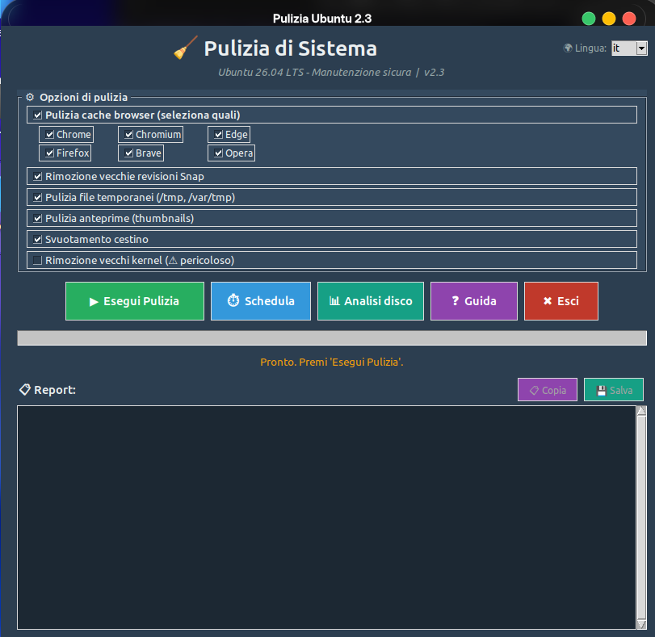

# 🧹 Pulizia Ubuntu

<div align="center">


[](https://github.com/coding4u-it/pulizia-ubuntu)
[](https://github.com/coding4u-it/pulizia-ubuntu/blob/main/LICENSE)
[](https://ubuntu.com/)
[](https://www.python.org/)

**Applicazione grafica per la manutenzione e la pulizia di Ubuntu**

</div>

---

## ✨ Funzionalità

| Funzione | Descrizione |
|----------|-------------|
| 🧹 Pulizia APT | Rimuove pacchetti orfani e cache |
| 🌐 Cache Browser | Chrome, Chromium, Edge, Firefox, Brave, Opera |
| 🗑 Cestino | Svuota il cestino dell'utente e di root |
| 🔧 Kernel | Rimuove i vecchi kernel in sicurezza |
| 📊 Analisi Disco | Mostra le directory più pesanti |
| ⏱ Schedulazione | Pulizia automatica via cron |
| 🌍 Lingua | Supporto Italiano / Inglese |
| 📈 Grafico | Confronto spazio disco prima/dopo |
| 📢 Notifiche | Avviso desktop al termine |
| 📖 Guida | Aiuto in linea (F1) |

---

## 🚀 Installazione

### Da sorgente

```bash
# Clona il repository
git clone https://github.com/coding4u-it/pulizia-ubuntu.git
cd pulizia-ubuntu

# Installa le dipendenze
sudo apt install python3-tk python3-pil python3-matplotlib libnotify-bin

# Avvia l'applicazione
python3 pulizia_gui.py
```

### Da pacchetto `.deb`

```bash
# Scarica l'ultima release dalla pagina Releases
wget https://github.com/coding4u-it/pulizia-ubuntu/releases/latest/download/pulizia-ubuntu-4.2.deb

# Installa (con gdebi per risolvere le dipendenze)
sudo apt install gdebi -y
sudo gdebi pulizia-ubuntu-4.2.deb
```

---

## 📸 Screenshot



---

## 🛠 Requisiti

- **Ubuntu** 22.04 LTS o superiore (testato su 26.04)
- **Python** 3.10+
- **Dipendenze**:
  - `python3-tk` — interfaccia grafica
  - `python3-pil` — gestione icone
  - `python3-matplotlib` — grafico spazio disco
  - `libnotify-bin` — notifiche desktop

---

## 📄 Licenza

Distribuito sotto licenza **MIT**. Vedi [`LICENSE`](LICENSE) per i dettagli.

---

## 👤 Autore

**coding4u-it**

- GitHub: [@coding4u-it](https://github.com/coding4u-it)
- Repository: [pulizia-ubuntu](https://github.com/coding4u-it/pulizia-ubuntu)

---

<div align="center">

**⭐ Se ti piace questo progetto, lascia una stella! ⭐**

</div>
